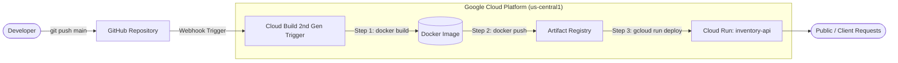

# Inventory Management API 📦🚀

Automated Continuous Integration and Continuous Deployment (CI/CD) pipeline for a Python Flask Inventory Management service deployed to **Google Cloud Run** using **Google Cloud Build** and **Artifact Registry**.

---

## 📋 Table of Contents
- [Architecture & Tech Stack](#-architecture--tech-stack)
- [Application Overview](#-application-overview)
- [API Endpoints](#-api-endpoints)
- [CI/CD Pipeline Workflow](#-cicd-pipeline-workflow)
- [Containerization Details](#-containerization-details)
- [Testing Endpoints](#-testing-endpoints)

---

## 🏗 Architecture & Tech Stack

- **Backend Framework:** Python 3.9 & Flask 2.3.3
- **WSGI Production Server:** Gunicorn
- **Containerization:** Docker (multi-stage lightweight slim image)
- **Image Registry:** Google Artifact Registry (`cloud-run-source-deploy`)
- **CI/CD Automation:** Google Cloud Build (`cloudbuild.yaml`)
- **Serverless Hosting:** Google Cloud Run (Managed, Auto-scaling, HTTPS)



---

## 📦 Application Overview

The application provides a RESTful API to manage product catalog and stock levels in real time. The mock inventory includes:

| SKU | Product Name | Initial Stock |
| :--- | :--- | :--- |
| `SKU001` | Laptop | 10 |
| `SKU002` | Mouse | 50 |
| `SKU003` | Keyboard | 25 |

---

## 🔌 API Endpoints

### 1. List All Products
Returns a JSON object with all available inventory items.
- **URL:** `/` or `/products`
- **Method:** `GET`
- **Response:**
  ```json
  {
    "SKU001": { "name": "Laptop", "stock": 10 },
    "SKU002": { "name": "Mouse", "stock": 50 },
    "SKU003": { "name": "Keyboard", "stock": 25 }
  }
  ```

### 2. Get Product by SKU
Retrieves specific product stock details.
- **URL:** `/products/<sku>`
- **Method:** `GET`
- **Example:** `/products/SKU001`
- **Success Response (200 OK):**
  ```json
  {
    "name": "Laptop",
    "stock": 10
  }
  ```
- **Not Found Response (404 Not Found):**
  ```json
  { "message": "Product not found" }
  ```

### 3. Add Stock to Product
Increments the stock level for an existing product.
- **URL:** `/products/<sku>/add`
- **Method:** `POST`
- **Headers:** `Content-Type: application/json`
- **Payload:**
  ```json
  { "amount": 5 }
  ```
- **Success Response (200 OK):**
  ```json
  {
    "name": "Laptop",
    "stock": 15
  }
  ```

---

## ⚙️ CI/CD Pipeline Workflow

The build and deployment process is defined in [`cloudbuild.yaml`](cloudbuild.yaml) and executes automatically upon every push to the `main` branch:

1. **Build Docker Image:** Builds the container and tags it with the Git commit hash (`$COMMIT_SHA`).
2. **Push to Artifact Registry:** Uploads the image to `us-central1-docker.pkg.dev/$PROJECT_ID/cloud-run-source-deploy/inventory-api:$COMMIT_SHA`.
3. **Deploy to Cloud Run:** Deploys the container to the Cloud Run service `inventory-api` in `us-central1` with unauthenticated invocations allowed.

---

## 🐳 Containerization Details

Defined in [`Dockerfile`](Dockerfile):
- Based on `python:3.9-slim-buster` for minimal attack surface and reduced image size.
- Runs via Gunicorn binding to `0.0.0.0:8080`.
- Includes automated health check:
  ```dockerfile
  HEALTHCHECK CMD curl --fail http://localhost:8080/products/SKU001 || exit 1
  ```

---

## 🧪 Testing Endpoints

Once deployed to Cloud Run, test the service using `curl`:

```bash
# Set your Cloud Run URL
export APP_URL="https://inventory-api-<hash>-uc.a.run.app"

# 1. Fetch SKU001 details
curl -X GET "${APP_URL}/products/SKU001"

# 2. Add stock to SKU001
curl -X POST \
  -H "Content-Type: application/json" \
  -d '{"amount": 5}' \
  "${APP_URL}/products/SKU001/add"

# 3. View all products
curl -X GET "${APP_URL}/products"
```
